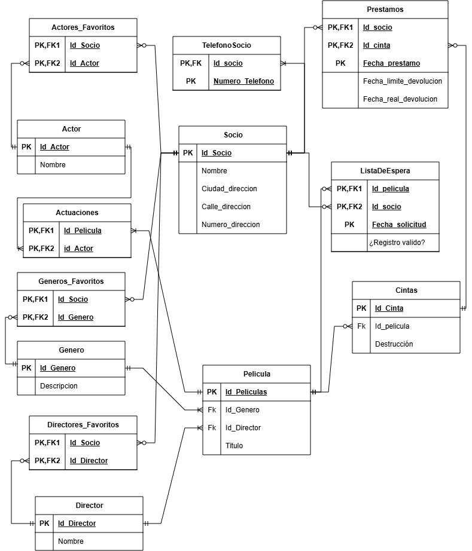

# Trabajo Práctico N°5


## _Autoras:_ 
* Berrino Eugenia
* Piacentino Melina

## **PARTE 1:** Bases de Datos

### 1. ¿Qué tipo de base de datos es? 

Respuesta

### 2. Armar el diagrama entidad-relación de la base de datos dada. 


### 3. Armar el Modelo relacional de la base de datos dada.


### 4. Considera que la base de datos está normalizada. En caso que no lo esté, ¿cómo podría hacerlo?

Respuesta

## **PARTE 2:** Bases de Datos

### 1. Cuando se realizan consultas sobre la tabla paciente agrupando por ciudad los tiempos de respuesta son demasiado largos. Proponer mediante una query SQL una solución a este problema.

```
query 1
```
(imagen del resultado de la query)


